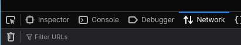
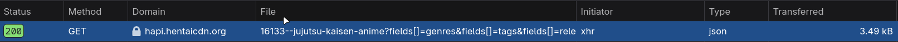
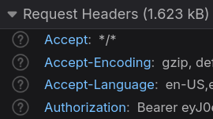

У animelib обычный bearer-токен, его можно вытащить из devtools руками. Сайт русскоязычный, поэтому и инструкция на русском.

1. Залогиньтесь на https://animelib.org
2. Откройте https://animelib.org/ru/catalog
3. Откройте devtools (Ctrl+Shift+I или F12), вкладка Network

Если запросов не видно, перезагрузите страницу.

4. Найдите в списке GET-запрос, как на скриншоте

5. В заголовках запроса найдите `Authorization`

Скопируйте токен целиком и вставьте в конфиг.

---

host_url находится в том же запросе

